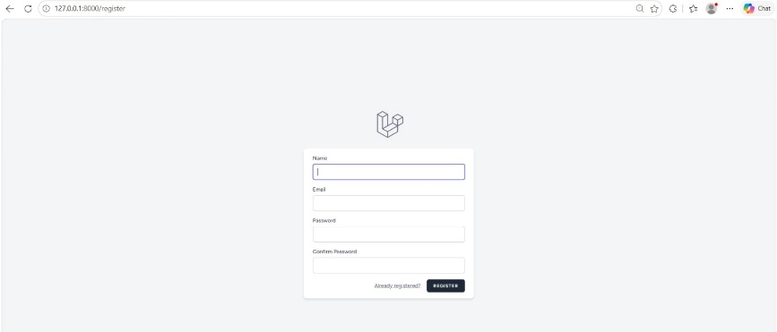
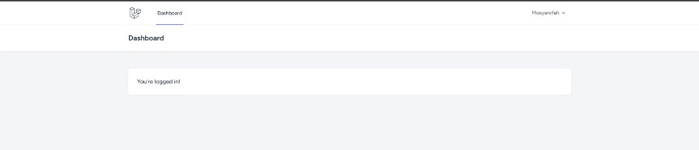
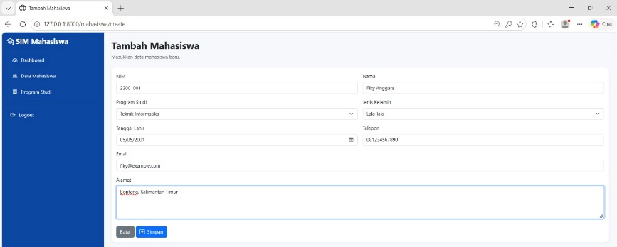
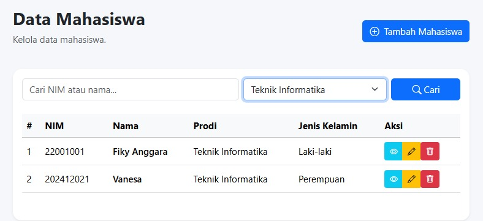
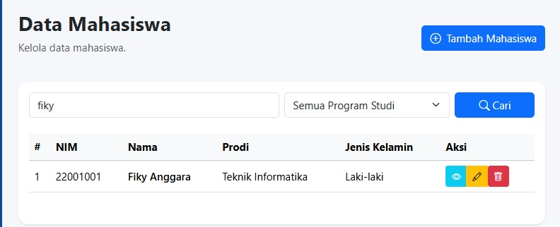
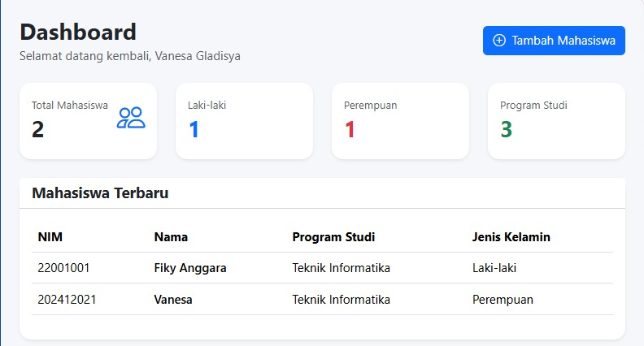
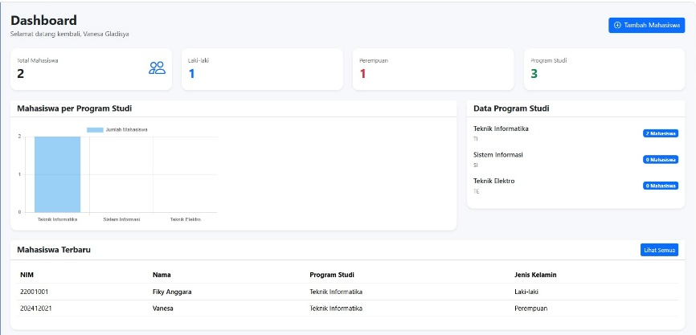

# 🎓 SIM-Mahasiswa

Sistem Informasi Manajemen Mahasiswa berbasis web yang dibangun menggunakan **Laravel**. Aplikasi ini membantu pengelolaan data mahasiswa: mulai dari pendaftaran akun, penambahan dan pencarian data, hingga ringkasan statistik pada dashboard.


---

## 📑 Daftar Isi

- [Fitur Utama](#-fitur-utama)
- [Tahapan Pengembangan](#-tahapan-pengembangan)
- [Instalasi](#-instalasi)
- [Struktur Data Mahasiswa](#-struktur-data-mahasiswa)
- [Tim Pengembang](#-tim-pengembang)

---

## 💡 Fitur Utama

| Fitur | Deskripsi |
| --- | --- |
| 🔐 Registrasi & Login | Pendaftaran akun untuk admin dan user |
| ➕ Tambah Mahasiswa | Form input data mahasiswa lengkap |
| 📋 Data Mahasiswa | Daftar mahasiswa dengan aksi lihat, ubah, dan hapus |
| 🔍 Pencarian & Filter | Cari berdasarkan NIM atau nama, serta filter per program studi |
| 📊 Dashboard | Statistik jumlah mahasiswa, diagram per program studi, dan daftar mahasiswa terbaru |

---

## 🛠️ Tahapan Pengembangan

Berikut dokumentasi langkah pembuatan SIM-Mahasiswa beserta tangkapan layar di setiap tahap.

### 1. Halaman Register

Halaman pendaftaran akun untuk admin dan user. Pengguna mengisi **Name**, **Email**, **Password**, dan **Confirm Password**, lalu menekan tombol **Register**. Tersedia juga tautan *Already registered?* bagi pengguna yang sudah punya akun. Halaman ini menjadi pintu masuk utama sebelum pengguna dapat mengakses sistem.



### 2. Halaman Dashboard Awal

Setelah berhasil mendaftar dan masuk, pengguna diarahkan ke dashboard awal. Pada tahap ini tampilan masih sederhana: hanya menu **Dashboard**, nama pengguna di pojok kanan atas, dan pesan *"You're logged in!"* sebagai penanda bahwa autentikasi berjalan dengan benar. Halaman ini menjadi kerangka dasar yang dikembangkan pada tahap berikutnya.



### 3. Halaman Tambah Mahasiswa

Halaman form untuk memasukkan data mahasiswa baru. Tampilan sudah memakai **sidebar** dengan menu *Dashboard*, *Data Mahasiswa*, *Program Studi*, dan *Logout*. Kolom yang tersedia: **NIM, Nama, Program Studi, Jenis Kelamin, Tanggal Lahir, Telepon, Email,** dan **Alamat**. Data disimpan dengan tombol **Simpan**, atau dibatalkan dengan tombol **Batal**.



### 4. Halaman Data Mahasiswa

Halaman untuk melihat dan mengelola seluruh data mahasiswa dalam bentuk tabel (nomor, NIM, nama, program studi, jenis kelamin). Setiap baris memiliki tombol aksi: **lihat detail** (biru muda), **ubah** (kuning), dan **hapus** (merah). Di bagian atas terdapat kolom pencarian, filter program studi, serta tombol pintas **Tambah Mahasiswa**.



### 5. Fitur Search

Fitur pencarian untuk menemukan data mahasiswa dengan cepat. Pengguna mengetik **NIM atau nama** pada kolom pencarian, dapat menambahkan filter **program studi**, lalu menekan tombol **Cari**. Pada contoh di bawah, kata kunci *"fiky"* hanya menampilkan satu data yang sesuai, sehingga tabel menjadi lebih ringkas.



### 6. Update Dashboard: Menampilkan Data Mahasiswa

Dashboard diperbarui agar menampilkan data yang tersimpan. Terdapat sapaan kepada pengguna, empat kartu ringkasan (**Total Mahasiswa, Laki-laki, Perempuan, Program Studi**), serta tabel **Mahasiswa Terbaru** yang berisi NIM, nama, program studi, dan jenis kelamin. Dengan begitu, kondisi data dapat dipantau langsung saat membuka dashboard.



### 7. Update Lanjutan Dashboard: Menampilkan Diagram

Pengembangan lanjutan dashboard dengan visualisasi data. Ditambahkan **diagram batang "Mahasiswa per Program Studi"** untuk membandingkan jumlah mahasiswa tiap prodi, panel **Data Program Studi** (Teknik Informatika, Sistem Informasi, Teknik Elektro) lengkap dengan jumlah mahasiswanya, dan tombol **Lihat Semua** pada tabel mahasiswa terbaru untuk menuju halaman data lengkap.



---

## ⚙️ Instalasi

> **Prasyarat:** PHP, Composer, Node.js & NPM, serta database (misalnya MySQL).

```bash
# 1. Clone repository
git clone https://github.com/<username>/<nama-repo>.git
cd <nama-repo>

# 2. Install dependensi
composer install
npm install

# 3. Salin file environment dan generate key
cp .env.example .env
php artisan key:generate
```

Atur koneksi database pada file `.env`:

```env
DB_CONNECTION=mysql
DB_HOST=127.0.0.1
DB_PORT=3306
DB_DATABASE=nama_database
DB_USERNAME=root
DB_PASSWORD=
```

Lanjutkan dengan migrasi dan jalankan aplikasi:

```bash
# 4. Migrasi database
php artisan migrate

# 5. Jalankan aplikasi
npm run dev
php artisan serve
```

Buka **http://127.0.0.1:8000** di browser, lalu daftar akun melalui halaman `/register`.

---

## 🗂️ Struktur Data Mahasiswa

| Kolom | Keterangan |
| --- | --- |
| NIM | Nomor induk mahasiswa |
| Nama | Nama lengkap mahasiswa |
| Program Studi | Teknik Informatika, Sistem Informasi, atau Teknik Elektro |
| Jenis Kelamin | Laki-laki / Perempuan |
| Tanggal Lahir | Tanggal lahir mahasiswa |
| Telepon | Nomor telepon aktif |
| Email | Alamat email mahasiswa |
| Alamat | Alamat tempat tinggal |

---

## 👥 Tim Pengembang

| Nama | NIM |
| --- | --- |
| Muhammad Ikbal | 202412008 |
| Achmad Gibran | 202412003 |
| Mosyarofah | 202412032 |
| Vanesa Gladisya Mamanua | 202412021 |
| Sarmila | 202312080 |

---

<p align="center">Dibuat menggunakan Laravel</p>
